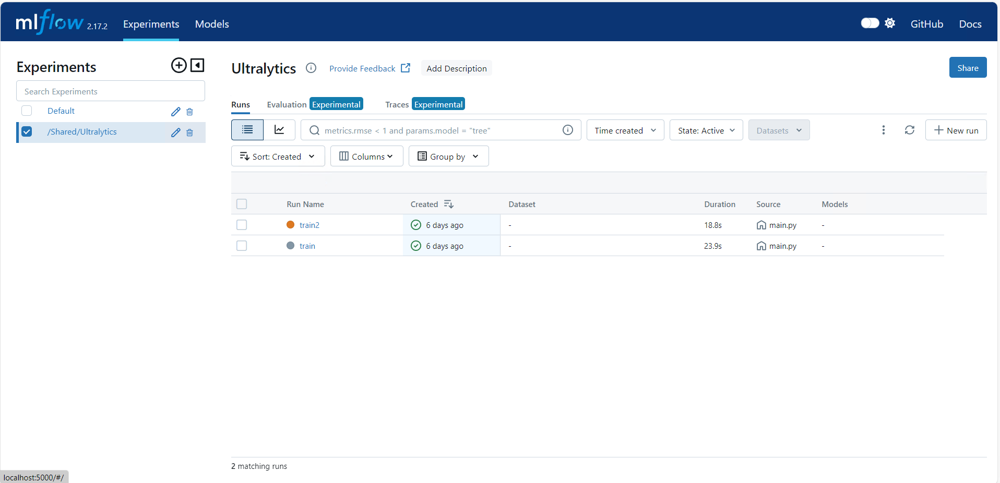
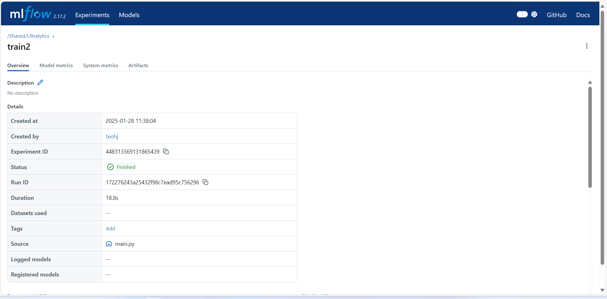
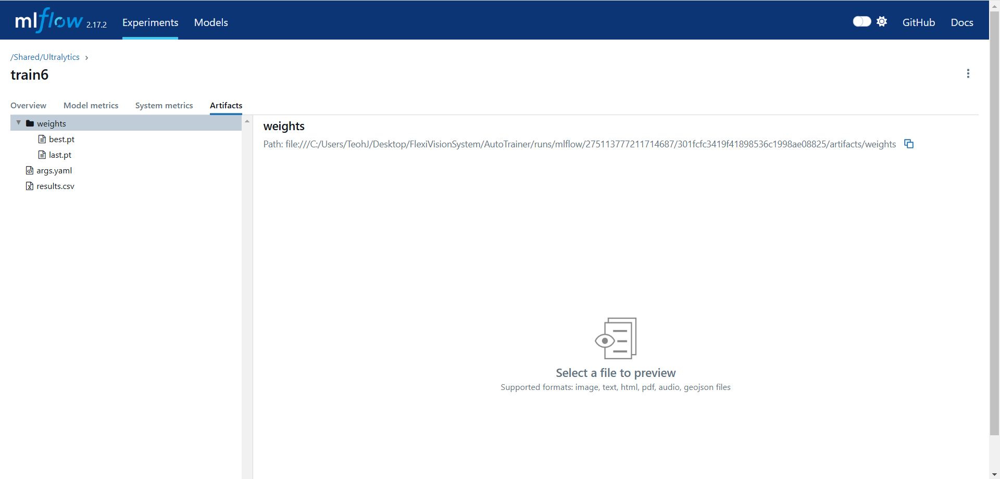

Last modified: 13/11/2024

# How to use the autotrainer in YoloTraining

## Running Experiments
1. In [main.conf](main.conf), ensure `ultralyticsSettingPath` is set to the proper ultralytics setting file path, which is usually located at `C:/Users/<username>/AppData/Roaming/Ultralytics/settings.json`. Also set the `experimentFilePath` to your desired experiment config file.
2. In the `settings.json` file found in step 1, ensure that `datasets_dir` is set to the directory of your dataset. ALL dataset paths mentioned from now on will be relative from `datasets_dir`. 
3. Set up the experiment config file mentioned in step 1. Find out more on how to set it up [here](#experiment-config-file).
4. Set up the test config file for the experiment you want to run. Find out more about it [here](#test-config-file).
5. Set up the data config file for your tests. Find out more about it [here](#data-config-file)
6. In `FlexiVisionSystem` folder, double click on the `AutoTrain.bat` file.

### Experiment Config File
Experiment config files contains the configurations for an experiment. An experiment can contain multiple tests, compartmentalizing and organising research findings. Here is an example of the [experiment config file](Experiment.conf), below is description of the settings:
- **name**: Name of the experiment. mlflow will be showing this as the test name IF it is on train mode.
- **configFileDirectory**: Directory you want to get all the listed config file from. (Can be relative from AutoTrainer folder)
- **configFiles**: Filepath of the test config files to run for the experiment. ALL of the listed test will be ran. You can replace the config files with other config files in the future while using the same experiment name if you wish to.

### Test Config File
Test config file contains the configurations for running a test. A test can be training a model, evaluating a model or both. If you want the simplest start, just use the demo [here](config/YB_demo.conf) and change the variables in `[mode]` and the `data` variable in `[test]` and `[train]`. If not, continue reading below to discover each variable's usage:

- **[log][mlflow]**: enable or disable mlflow logging, for experiment tracking. 
- **[log][export_onnx]**: enable or disable exporting final model as onnx.
- **[model][modelpath]**: path to the pretrained model.
- **[model][nullImgPath]**: path to null image. Any image would do. 
- **[mode][test]**: enable or disable running of evaluation on model. If this is active, train cannot be active. 
- **[mode][train]**: enable or disable running of model training. If this is active, test cannot be active. 
- **[test][data]**: path to data config file for testing.
- **[test][batch]**: batch size for evaluation process.
- **[train][auto_augmentation]**: enable or disable auto augmentation from ultralytics. Auto augmentation techniques includes Mosaic, RandomPerspective, MixUp, Albumentations, RandomHSV, RandomFlip and RandomFlip. The values for augmentation here are fixed in backend library and not easily changeable.
- **[train][modelStoragePath]**: Path to store the model, if not given, it will only be stored in the run directory. if you want pt file, end it with pt. If you want onnx file, end it with onnx, provided [log][export_onnx] is 1. You can indicate more than one file, separated by comma, to facilitate saving of onnx and pt file. 
- **[train][data]**: path to data config file for training.
- **[train][batch]**: batch size for training process. Indicating -1 will allow ultralytics to automatically find the batch size value that utilizes 60% of the GPU memory. 

Only 3 varaibles in `[train]` is mentioned? Yes, because you can find out more about the other variables at [ultralytic's page](https://docs.ultralytics.com/modes/train/#train-settings) 

### Data Config File
Data config file contains the configurations for selection of datasets. All the directories mentioned in the data config file are relative to `datasets_dir` in the ultralytics setting file. Below are description of the variables in the data config file:
- **names**: a list of classes. It should be arranged in chronological order, following the order listed in classes.txt when you are labeling the dataset. 
- **nc**: Number of classes.
- **path**: Relative path from the `datasets_dir` path. So all data path in train and val will be something like `datasets_dir/path/train`.
- **train**: List of paths to datasets for training. Required for both train and test, although it can be blank and will be unused during test.
- **val**: List of paths to datasets for validation. Required for both train and test. During test, only this will be used for evaluating the model.

## Tracking Experiment Results
The artifacts of the experiments will be stored in mlflow if it's enabled. If not, the test data will be stored in [runs/detect](runs/detect/). The weight of the model will be there if you trained the model. The validation results will be there too if you only evaluated the model.

If you have mlflow activated, the mlflow results will be saved in [runs/mlruns](runs/mlflow/). To access it via mlflow's GUI, double click on `MLFlowTrain.bat` in [FlexiVisionSystem](..), then open `localhost:5000` on your web browser. The entries will all be saved under the experiment name as mentioned in [Experiment Config File](#experiment-config-file). If you want the training and testing entries to be in separate entries, you would need to run the program multiple times with different experiments.

## mlflow navigation
After you have run your open the mlflow, you would want to see how the training or testing went, so this section will explain how you can navigate through the page understand the extracted information. Be careful with the test entries, they take up **QUITE** a lot of storage space, so delete the experiments when you don't need them anymore.

### Main page
This is the main page of the mlflow after you opened `localhost:5000`, click on your experiment on the left side to see the test entries you have created when you run training. You can sort the entries or select relevant test entries for examination. The testing entries will be named val followed by their id number, depending on which test was ran firsts. The training entries will be named according to the name provided in the [Test Config File](#test-config-file). You might see `/Shared/Ultralytics` at the right side as an experiment, **DO NOT** delete it, it's essential for ultralytics's backend. 

### Test page
The test page will appear when you click on one of the result, for example train2. The main page of this result will show you metadata of the training or testing such as creation date, the hyperparameters and training metrics. 

### Artifacts
Artifacts contains files that are relevant to the test, for example, weight files from the training or for testing. Train and Test has different output, try both out and see what type of artifact does each operation produce. 

